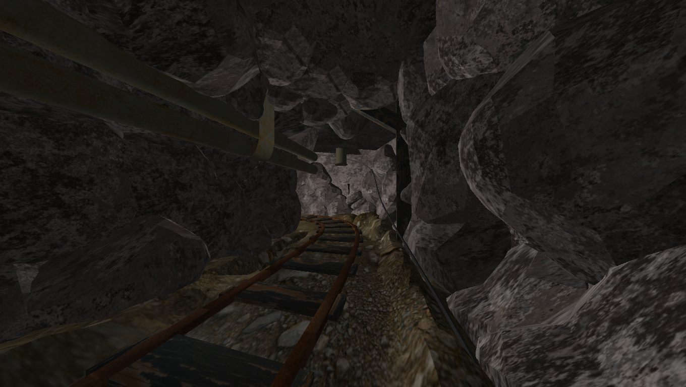
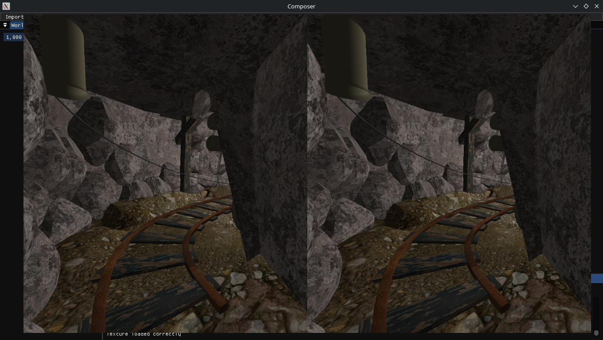

# SceneComposer

A lightweight and open-source OpenGL/OpenXR compositing and rendering engine.


Current VR support is only partial, only allowing scene viewing through a headset but not interaction with other features.  
Starting the software in VR mode requires using the cmd line argument `vr_mode`:

```bash
$ ./bin/composer.out vr_mode
```

<table>
    <tr>
        <td></td>
        <td></td>
    </tr>
    <tr>
        <td>Desktop Mode</td>
        <td>VR Mode</td>
    </tr>
</table>

# Features

- Lightweight (executable is ~1.60MB).
- Cross-platform.
- VR Support.
- Phong lightning.
- Import of 3d models with texture support.
- HDRI environment.
- Scene rendering.
- Object picking through custom FBO.
- GUI with DearImGUI.

# Contributing

PR's are welcome.  
A complete overview of the project can be found in `ARCHITECTURE.md` at the root of the repo.

# TODO

- Infinite grid.
- Individual picking.
- Scene Saving System.
- Redo and Undo.
- Support a more variety of textures.
- Multiple lightnings.
- Unique software name.

# License

This project is licensed under GPL-3.0.

# Assets credit

Default HDRI is from <a href="https://polyhaven.com/a/kloofendal_48d_partly_cloudy_puresky">polyhaven</a>.
